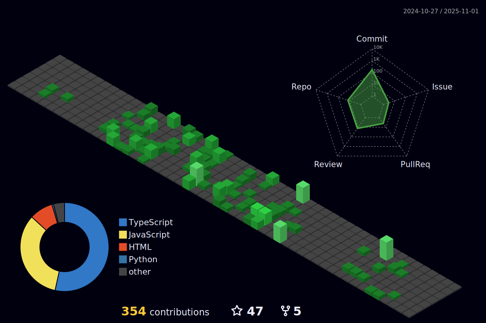

<h1 align="center">Hi 😃, I'm Mahdi Hazrati</h1> 
<!-- <h3 align="center">Passionate Software Engineer, Tehran 🚀</h3> -->
<h2 align="center">Maker</h2>
<h3 align="center">Web Application Developer [ React JS / Next JS ]</h3>

<!-- <h4 align="center" >Email: mahdi@nextproduction.dev</h4>  -->
<h1 align="center"></h1>

<div align="center">
  <a href="https://telegram.me/TheMahdiHazrati" target="_blank">Telegram</a> /
  <a href="https://www.linkedin.com/in/mahdihazratidev/" target="_blank">Linkedin</a> /
  <a href="https://youtube.com/@MahdiCodingJourney" target="_blank">Youtube</a> /
  <a href="mailto:mahdi@nextproduction.dev" target="_blank">Email</a>
</div>

<details>
	<summary>Mahdi's Open-Source Activity?</summary>
<!-- Mahdi-Hazrati/mahdi-hazrati is a ✨ _special_ ✨ repository because its `README.md`, see workflows folder -->
	



<br clear="both">


</details>

<br clear="both">

<div align="center">
  
  
  
  
  
  
  
  
  
  
  
  
  
  
  
  
  
</div>

<br clear="both">

```
                _________________
               /                /|
              /                / |
             /________________/ /|
          ###|      ____      |//|
         #   |     /   /|     |/.|
        #  __|___ /   /.|     |  |_______________
       #  /      /   //||     |  /              /|                  ___
      #  /      /___// ||     | /              / |                 / \ \
      # /______/!   || ||_____|/              /  |                /   \ \
      #| . . .  !   || ||                    /  _________________/     \ \
      #|  . .   !   || //      ________     /  /\________________  {   /  }
      /|   .    !   ||//~~~~~~/   0000/    /  / / ______________  {   /  /
     / |        !   |'/      /9  0000/    /  / / /             / {   /  /
    / #\________!___|/      /9  0000/    /  / / /_____________/___  /  /
   / #     /_____\/        /9  0000/    /  / / /_  /\_____________\/  /
  / #                      ``^^^^^^    /   \ \ . ./ / ____________   /
 +=#==================================/     \ \ ./ / /.  .  .  \ /  /
 |#                                   |      \ \/ / /___________/  /
 #                                    |_______\__/________________/
 |                                    |               |  |  / /       
 |                                    |               |  | / /       
 |                                    |       ________|  |/ /________       
 |                                    |      /_______/    \_________/\       
 |                                    |     /        /  /           \ )       
 |                                    |    /OO^^^^^^/  / /^^^^^^^^^OO\)       
 |                                    |            /  / /        
 |                                    |           /  / /
 |                                    |          /___\/
 |                                    |           oo
 |____________________________________|

```

 


 
